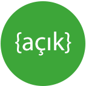

# Açık Kaynak İnisiyatifi

Merhaba,

Bu organizasyon GitHub'ın kendi doğal araçları kullanılarak Türkçe konuşan kullanıcıların açık kaynaklı projelere katkı sağlamasına yardımcı olmak amacıyla oluşturulmuştur.

Amaçları arasında,

- Açık kaynak felsefesini çeşitli kaynak/içerik destekleriyle kullanıcılara aktarmak,
- Açık kaynak projelere nasıl katkıda bulunabileceği konusunda kaynak/içerik sağlamak,
- Türkçe konuşan kullanıcıların teknik veya dil bariyerlerinin kaldırması için çalışmalar yapmak,
- Kullanıcıların kendi veya başka açık kaynak projelerini tanıtması için imkan sağlamak,
- Halihazırda veya yeni açık kaynak projelerine katılımcı bulmak,
- Birlikte çalışma ve katılım için insanlara bir platform sunmak,

bulunmaktadır.

Eğer proje ve birlikte çalışma deneyimini arttırmak isteyen, başka platformlarda geliştirme yapmak konusunda bir başlangıç arayan bir yazılımcıysanız, veya yalnızca açık kaynak'a katılımcı olmak istiyorsanız bu adresi ziyaret edip kendinize katılım sağlayabileceğiniz, sizden yardım bekleyen bir proje bulabilirsiniz.

Daha da iyisi bu repository altında "issue" oluşturarak, (örneğin) Bootstrap üzerinde istediğiniz bir özelliği diğer kişilere tanıtarak bunun dökümantasyonundan testlerinde kadar ilgilenecek bir ekip oluşturup Bootstrap'in istediği standartlarda bir Pull Request hazırlayabilirsiniz.

## Alt Sayfalar

- [Projeler](Projeler/)
   - [Araç](Projeler/Arac/)
   - [Web Arkayüz](Projeler/Web%20Arkayuz/)
   - [Web Önyüz](Projeler/Web%20Onyuz/)
   - [Web Proje](Projeler/Web%20Proje/)
   - [Web Servis](Projeler/Web%20Servis/)
- [Katılım Bekleyenler Projeler](KatilimBekleyenler/)
- [Kaynaklar](Kaynaklar/)
   - Açık Kaynak Yazılım
     - [Nedir?](Kaynaklar/acik_kaynak_yazilim/nedir.md)
     - [Özgür Yazılım ve Açık Kaynak arasındaki farklar](Kaynaklar/acik_kaynak_yazilim/vs_ozgur_yazilim.md)
     - [Lisans modelleri](Kaynaklar/acik_kaynak_yazilim/lisanslar.md)
   - GitHub Açık Kaynak Platformu
     - [Genel](Kaynaklar/github_platformu/genel.md)
   - Katılım
     - [Açık Kaynak projelerde katılım tanımlaması](Kaynaklar/katilim/katilim_tanimi.md)
     - [Nasıl katılım sağlarım?](Kaynaklar/katilim/nasil_katilim_saglanir.md)
     - [GitHub üzerinden katılım sağlamak](Kaynaklar/katilim/github_uzerinden_katilim.md)
   - Organizasyon
     - [Açık Kaynak projeme katılımcı nasıl bulabilirim?](Kaynaklar/organizasyon/katilimci_bulma.md)
     - [Katılım fıkrım var ama ingilizce eksiğim var](Kaynaklar/organizasyon/dil_destek.md)
     - [Katılım fikrim var ama teknik eksiğim var](Kaynaklar/organizasyon/teknik_destek.md)
     - [Katılım fikrim var ama fikir danışmaya ihtiyacım var](Kaynaklar/organizasyon/teknik_danisma.md)

___
(Bu veya diğer sayfalar henüz oluşturulma aşamasında olup yakın zamanda tekrar revize edilecektir, fikirleriniz varsa duymak isteriz.)
